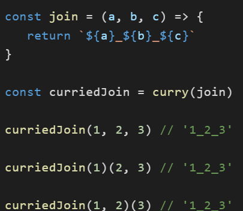

###### Solution 1
``` JS
// This is a JavaScript coding problem from BFE.dev

/**
 * @param { (...args: any[]) => any } fn
 * @returns { (...args: any[]) => any }
 */

function curry(fn) {
  // your code here
  return function curried(...args) {
    if(fn.length <= args.length){
      return fn.apply(this,args);
    }else{
      return curried.bind(this,...args);
    }
  }
}
```
###### Solution 2
```JS
function curry (fn){
    const ln = fn.length;
    return function tmp(...args) {
        if(args.length >= ln){
            return fn(...args);
        }else{
            return function (...arguments) {
                return tmp.apply(this,[...args,...arguments]);
            }
        }
    }
}
```
