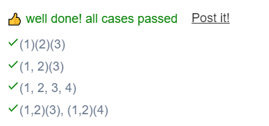

``` JS
// This is a JavaScript coding problem from BFE.dev

/**
 * @param { (...args: any[]) => any } fn
 * @returns { (...args: any[]) => any }
 */

function curry(fn) {
  // your code here
  return function curried(...args) {
    if(fn.length <= args.length){
      return fn.apply(this,args);
    }else{
      return curried.bind(this,...args);
    }
  }
}
```

