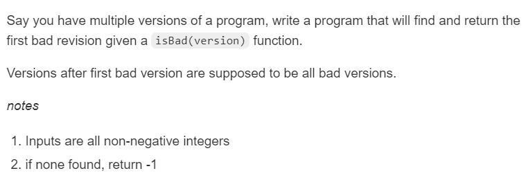
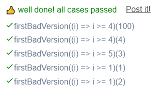

```JS
// This is a JavaScript coding problem from BFE.dev

/*
 type IsBad = (version: number) => boolean
 */

/**
 * @param {IsBad} isBad
 */

function firstBadVersion(isBad) {
  // firstBadVersion receive a check function isBad
  // and should return a closure which accepts a version number(integer)

  return (version) => {
    // write your code to return the first bad version
    // if none found, return -1

    let left = 0;
    let right = version;

    while(left <= right){
      let mid = left + Math.floor((right-left)/2);

      if(isBad(mid)){
        right = mid-1;
      }else{
        left = mid+1;
      }
    }
    return isBad(left)? left: -1;
  }
}
```


