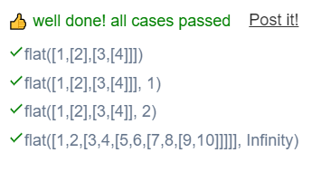

```JS
// This is a JavaScript coding problem from BFE.dev

/**
 * @param { Array } arr
 * @param { number } depth
 * @returns { Array }
 */

function flat(arr, depth = 1) {
  // your imeplementation here
  let res = [];

  if(!Array.isArray(arr)){
    console.log("Please Enter Array");
  }

  else{
    arr.forEach(el => {
      if(Array.isArray(el) && depth > 0){
        res.push(...flat(el,depth-1))
      }else{
        res.push(el);
      }
    });
  }
  return res;
}
```
###### Solution 2
```JS
function flat(arr, depth = 1) {
  // your imeplementation here
  let helper = (ar,dep) => {
    if(dep > depth){
      return [ar];
    }
    let outputArr = []
    for(let i=0;i<ar.length;i++){
      if(Array.isArray(ar[i])){
        outputArr.push(...helper(ar[i],dep+1));
      }else{
        outputArr.push(ar[i]);
      }
    }
    return outputArr;
  }
  return helper(arr,0);
}
```
