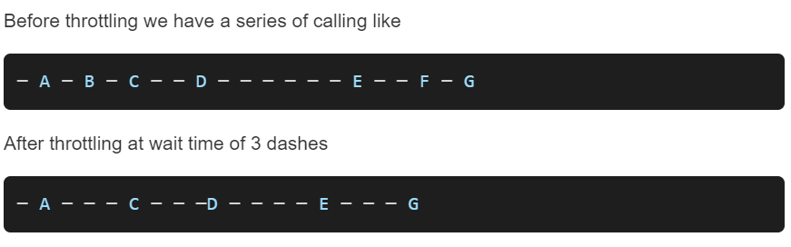
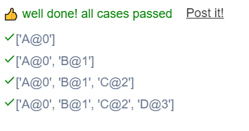

```JS
// This is a JavaScript coding problem from BFE.dev

/**
 * @param {(...args:any[]) => any} func
 * @param {number} wait
 * @returns {(...args:any[]) => any}
 */

function throttle(func, wait) {
  // your code here
 
  // 1. cooling or not
  // 2. call postponed

  // 1. once called
  //   - if not cooling, stash the call
  //   - if not cooling, run it and set the timer
  // 2. when time is up, reset cooling
  //   - if stashed call, call it and go to 1
  
  let timer = null;
  let stash = null;
  
  function startCooling() {
    timer = window.setTimeout(check,wait);
  }
  
  function check() {
    timer = null;
    if(stash){
      func.apply(stash[0],stash[1]);
      stash = null;
      startCooling()
    }
  }
  
  return function (...args) {
    if(timer !== null){
      stash = [this , args];
    }else{
      func.apply(this,args);
      startCooling()
    }
  }
}
```

