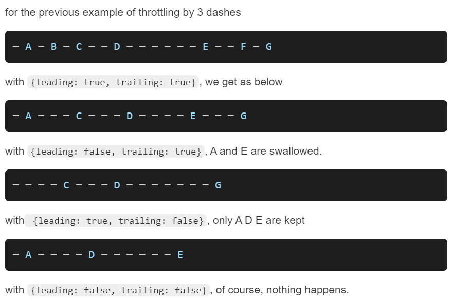
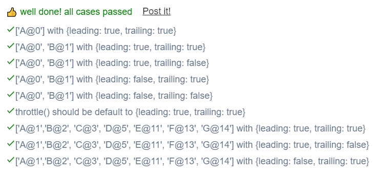

```JS
 
// This is a JavaScript coding problem from BFE.dev
  
/**
 * @param {(...args: any[]) => any} func
 * @param {number} wait
 * @param {boolean} option.leading
 * @param {boolean} option.trailing
 * @returns {(...args: any[]) => any}
 */

function throttle(func, wait, option = {leading: true, trailing: true}) {
  // your code here
  let timer = null;
  let stashed = null;
  const {leading, trailing} = option;
 
  function check () {
    timer = null;
    if(stashed !== null){
      func.apply(stashed[0], stashed[1]);
      stashed = null;
      timer = window.setTimeout(check,wait);
    }
  }
  
  return function (...args){
    console.log(stashed);
    if(timer !== null && trailing){
      stashed = [this, args];
      return;
    }
    if(timer === null && leading){
      func.apply(this, args);
      timer = window.setTimeout(check,wait);
      return;
    }
    if(trailing){
      stashed = [this, args];
      timer = window.setTimeout(check,wait);
    }
  }
 
}
```

