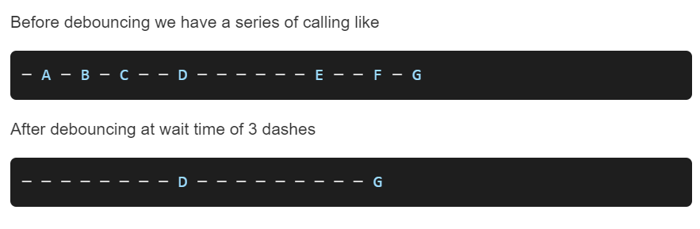
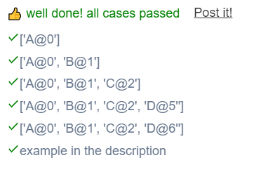

```JS
  
// This is a JavaScript coding problem from BFE.dev
  
/**
 * @param {(...args: any[]) => any} func
 * @param {number} wait
 * @returns {(...args: any[]) => any}
 */

function debounce(func, wait) {
  // your code here
  let timer = null;
  return function (...args) {
    let context = this;
    window.clearTimeout(timer);
    timer = window.setTimeout(function (){
      func.apply(context,args);
    },wait);
  }
}
```

