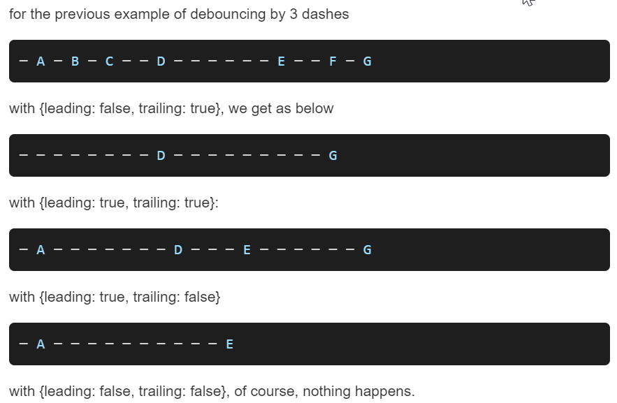
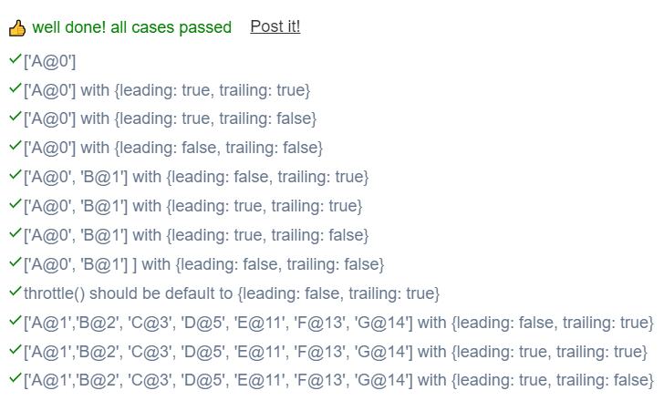

```JS 

// This is a JavaScript coding problem from BFE.dev
 
/**
 * @param {(...args: any[]) => any} func
 * @param {number} wait
 * @param {boolean} option.leading
 * @param {boolean} option.trailing
 * @returns {(...args: any[]) => any}
 */
function debounce(func, wait, option = {leading: false, trailing: true}) {
  // your code here
  
  let timer = null;
  return function(...args) {
    let isInvoked = false;
    if(timer === null  && option.leading){
      func.apply(this,args);
      isInvoked = true;
    }

    window.clearTimeout(timer);
    timer = window.setTimeout(function () {
      if(option.trailing && !isInvoked){
        func.apply(this,args);
      }
      timer = null;
    },wait);
  } 
}
```

```JS
 
// This is a JavaScript coding problem from BFE.dev
  
/**
 * @param {(...args: any[]) => any} func
 * @param {number} wait
 * @param {boolean} option.leading
 * @param {boolean} option.trailing
 * @returns {(...args: any[]) => any}
 */

function debounce(func, wait, option = {leading: false, trailing: true}) {
  // your code here
  
  let timer = null;
  let trailingArg = null;
  return function(...args) {
    if(timer === null  && option.leading){
      func.apply(this,args);
    }else{
      trailingArg = args;
    }
 
    window.clearTimeout(timer);
    timer = window.setTimeout(function () {
      if(option.trailing && trailingArg){
        func.apply(this,trailingArg);
      }
 
      timer = null;
      trailingArg = null;
    },wait);
  }
}
```

