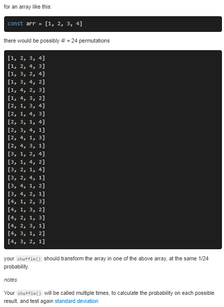

```JS
// This is a JavaScript coding problem from BFE.dev
  
/**
 * @param {any[]} arr
 * @returns {void}
 */
function shuffle(arr) {
  // modify the arr inline to change the order randomly
  
  for(let i=0;i<arr.length;i++){
    let j = i+ Math.floor(Math.random()* (arr.length-i));
    const temp = arr[i];
    arr[i] = arr[j];
    arr[j] = temp;
  }
}
```


