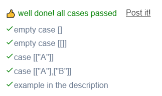

```JS
// This is a JavaScript coding problem from BFE.dev

/**
 * @param {string[][]} message
 * @return {string}
 */
function decode(message) {
  // your code here
  if(message.length === 0 || message[0].length === 0){
    return "";
  }
  let i = 0;
  let j = 0;
  let r = message.length;
  let c = message[0].length;
  let directions = [[+1,+1],[-1,1]];
  let selectedDirections= 0;
  let res = ""

  while(i>=0 && i<r && j>=0 && j<c){
    res = res+message[i][j];
    if(selectedDirections === 0 && (i+1) === r){
      selectedDirections = 1
    }else if(selectedDirections === 1 && (i-1) === -1){
      selectedDirections = 0
    }
    i += directions[selectedDirections][0];
    j += directions[selectedDirections][1];
  }
  return res;
}
```

```JS
    
// This is a JavaScript coding problem from BFE.dev
  
/**
 * @param {string[][]} message
 * @return {string}
 */
function decode(message) {
  // your code here
  if(message.length === 0 || message[0].length === 0){
    return "";
  }
  let row = 0;
  let col = 0;
  let rows = message.length;
  let cols = message[0].length;
  let directionY = 1;
  const directionX = 1;
  let result = "";
  
  while(col < cols){
    result = result + message[row][col];
    col += directionX;
    row += directionY;
 
    if(row > rows-1){
      directionY = -1;
      row -=2;
    }
  
    if(row < 0){
      directionY = 1;
      row +=2;
    }
  }
  
  return result;
}
```


